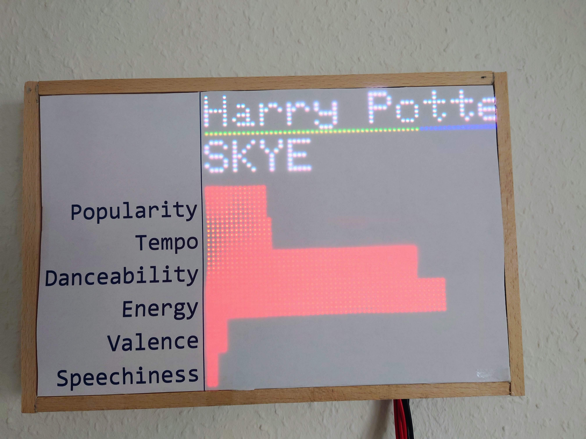
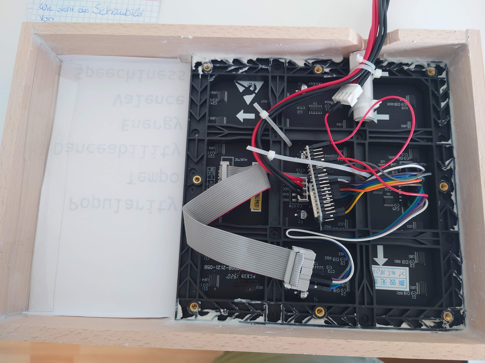

# Arduino Dislpay

A simple shiny screen to shwo Spotify Playback information. 

The display is connected to Spotify and only needs power and a Wifi connection. It uses a LED Matrix panel with 64 by 64 pixel and a ESP32.

## What is shown
* Title and Artist
* Position in the song
* Audio features
  * Popularity
  * Tempo
  * Dancebility
  * Energy
  * Valence
  * Speechiness

Information what these features mean in detail can be read on [Spotify Features](https://developer.spotify.com/discover/#audio-features-analysis "Spotify Features") 
